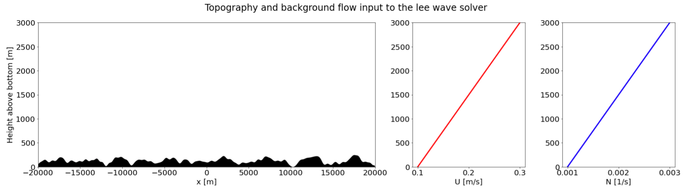
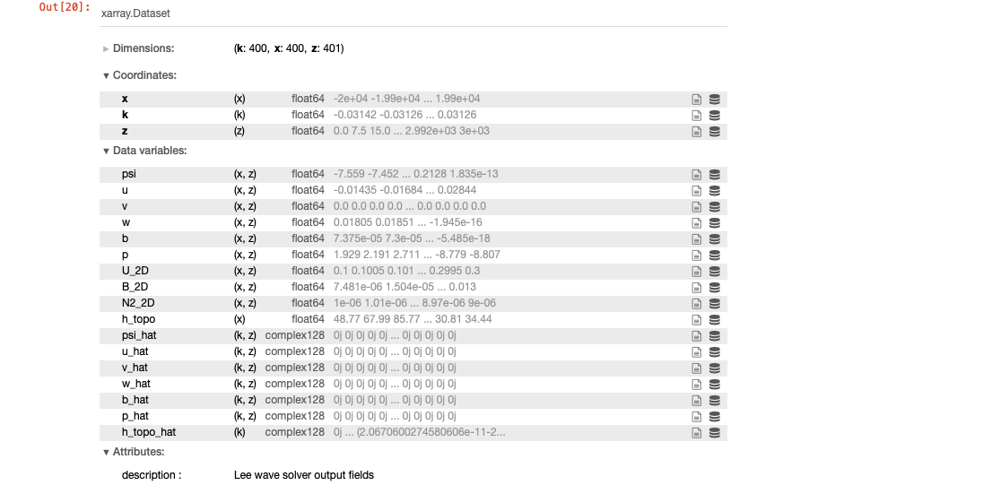
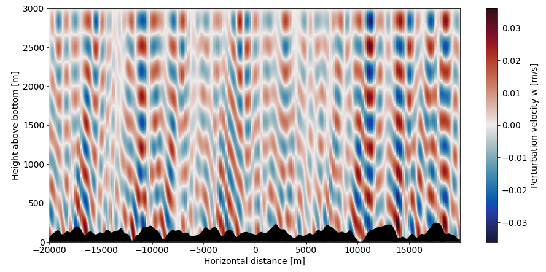
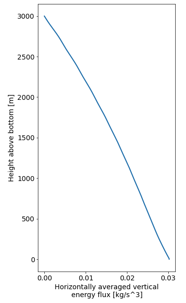

# Lee wave solver
This is a 2D linear lee wave solver, which can be used to find the steady wave field generated by flow over topography in the ocean or atmosphere.

The context and theory behind this solver is described in *Surface reflection of bottom generated oceanic lee waves, Baker & Mashayek (2021), Journal of Fluid Mechanics, https://doi.org/10.1017/jfm.2021.627

The solution and energy diagnostics can be found, with input options including:
- A given topography h(x), with several defaults available.
- A given background flow speed U(z), varying with height above bottom.
- A given background stratification N(z), varying with height above bottom.
- A freely radiating or rigid lid surface boundary condition.
- The effect of rotation, using the Coriolis parameter f.
- The hydrostatic approximation/ nonhydrostatic flow

Note that a MATLAB version of the solver is also available, please get in touch at lois.baker@ed.ac.uk if you'd like it.

## Getting started

Save the module *solver.py* from this repo, and import the *LeeWaveSolver* class:
```python
from solver import LeeWaveSolver
```
You will also need *xarray*, *numpy*, *scipy* and *matplotlib* installed in your environment.

The first step is to initialise the solver object with some grid dimensions:
```python
solver = LeeWaveSolver(nx=400, nz=401)
```
Next, set the topography. You have several options, which can be found in the docs.
```python
solver.set_topo(topo_type='GJ98')
```
Now set the background flow velocity and stratification:
```python
solver.set_mean_velocity(U_type='Linear', U_0=0.1, U_H=0.3)
solver.set_mean_stratification(N_type='Linear', N_0=0.001, N_H=0.003)
```
You can visualise the inputs that you've given:
```python
solver.plot_inputs()
```

You're now ready to solve! 
```python
solver.solve(f=0, open_boundary=False, hydrostatic=False)
```
The outputs are given in *xarray* datasets. *solver.wave_fields* contains the real and spectral 2D velocity, buoyancy and pressure fields.
*solver.diags* contains some 1D and 2D energy diagnostics, including energy flux, dissipation rate, mixing, and Eliassen Palm flux.
```python
solver.wave_fields
```


There's an inbuilt plotting function to make quick plots of the variables:
```python
solver.plot(solver.wave_fields.w)
```

```python
solver.plot(solver.diags.E_flux_1D)
```


You can use *matplotlib* or *xarray*'s inbuilt plotting functionality to make further plots.

The notebook *lee_wave_solver.ipynb* also demonstrates implementation of the solver.

## Authors

Lois Baker, Imperial College London, 2021. 
